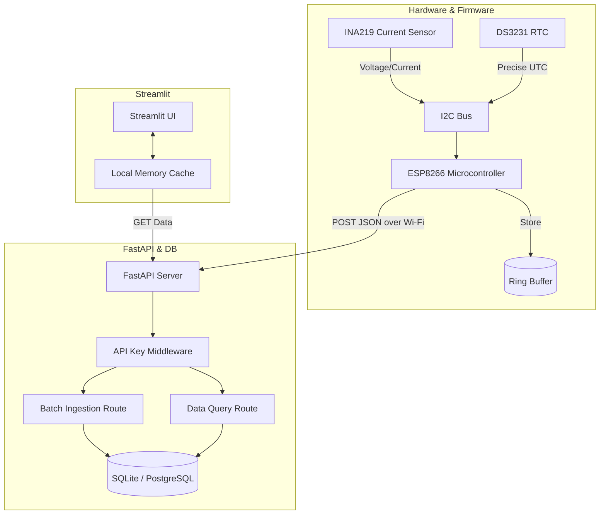
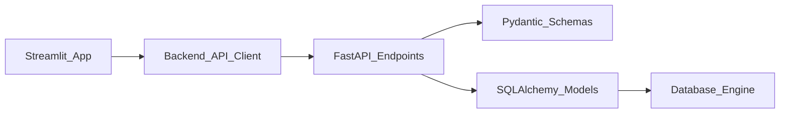

# Architecture & Systems Design

This document details the architectural decisions, design tradeoffs, and systems thinking applied to VoltWatch. The system is designed to be highly maintainable, scalable, and resilient against network failures.

## 1. High-Level System Architecture

VoltWatch operates across three primary layers: the Edge/Hardware layer, the Backend Integration layer, and the Presentation layer.

## 2. Design Tradeoffs & Decisions

### Async vs Sync
- **Backend:** FastAPI uses asynchronous routes (`async def`). While SQLite is generally synchronous, SQLAlchemy 2.0 with `aiosqlite` is used to prevent the ingestion endpoint from blocking the event loop during heavy I/O.
- **Firmware:** The ESP8266 is single-threaded. We utilize a non-blocking `millis()` loop approach instead of `delay()` to ensure the web provisioning server remains responsive while sensor polling continues.

### Network Resiliency (Buffer & Batch)
**Challenge:** IoT devices in industrial or remote setups often face temporary Wi-Fi disconnections.
**Solution:** The ESP8266 implements a ring buffer. Readings are timestamped precisely by the DS3231 RTC. If the `POST` request fails, the readings stay in the buffer. Upon reconnection, a batched JSON payload is transmitted. This ensures zero data loss and prevents lookahead bias in time-series analysis.

### SQLite vs Time-Series DB (e.g., InfluxDB/Timescale)
**Decision:** SQLite is the default to provide a frictionless Developer Experience (DX).
**Extensibility:** Because we abstract the database layer using SQLAlchemy ORM, moving to PostgreSQL or TimescaleDB requires only a single line change in the `.env` file (`DATABASE_URL`). This respects the "clean modularity" over "premature enterprise complexity" philosophy.

### Hardware vs Software Timestamps
**Decision:** We mandate a hardware RTC (DS3231). Relying on the server's timestamp at the time of ingestion introduces jitter and network latency artifacts. By stamping at the edge, data integrity is strictly maintained.

## 3. Error Handling Philosophy
1. **Fail Gracefully at the Edge:** If the sensor disconnects, the ESP8266 displays an error on the OLED rather than entering a boot loop.
2. **Strict Validation:** The backend uses Pydantic to strictly validate incoming payloads. Malformed data is rejected with a `422 Unprocessable Entity`, preventing database poisoning.
3. **Idempotent Retries:** Batch uploads do not currently rely on strict UUIDs per reading, but time-series queries handle deduplication based on exact timestamp matching.

## 4. Module Dependency Graph

## 5. Future Distributed Architecture
For massive scale (e.g., 10,000+ nodes), the architecture would evolve to include:
- **MQTT Broker:** Replacing raw HTTP POST with MQTT for lower overhead.
- **Message Queue:** Kafka or RabbitMQ between the ingestion API and the Database to handle massive write spikes.
- **Caching Layer:** Redis to cache the latest dashboard state to prevent DB hammering on page refreshes.
