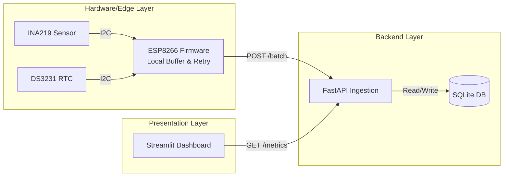

<div align="center">
  <h1>⚡ VoltWatch</h1>
  <p><strong>A high-performance, full-stack embedded systems pipeline for power & data logging.</strong></p>

  [](https://github.com/coderkrp/VoltWatch/actions)
  [](https://www.python.org/downloads/release/python-3110/)
  [](https://fastapi.tiangolo.com)
  [](https://streamlit.io/)
  [](https://github.com/esp8266/Arduino)
  [](https://opensource.org/licenses/MIT)

  [Architecture](#architecture-overview) •
  [Quick Start](#quick-start) •
  [Documentation](#technical-documentation) •
  [Contributing](#contributing)
</div>

<br>

## 📖 Project Overview

VoltWatch is an end-to-end telemetry system designed to monitor, log, and visualize electrical characteristics (voltage, current, power) with high precision and reliability. Built to demonstrate strong software engineering, architecture, and embedded systems integration, VoltWatch bridges the gap between raw hardware signals and real-time frontend visualization.

Unlike simple "toy" Arduino scripts, VoltWatch is architected as a robust distributed system:
- **Hardware/Firmware**: An ESP8266 interfacing with INA219 current sensors and DS3231 RTCs, featuring on-device buffering, retry logic, and dynamic provisioning.
- **Backend Service**: A FastAPI-based asynchronous data ingestion pipeline.
- **Frontend Dashboard**: A responsive Streamlit application for real-time visualization and historical analysis.

## ✨ Feature List

- **Edge-to-Cloud Resilience**: The ESP8266 firmware buffers up to 20 readings internally and automatically retries transmission upon network degradation.
- **Precision Timekeeping**: Hardware DS3231 RTC ensures UTC timestamps are exact at the point of measurement, avoiding network latency jitter.
- **On-Device Provisioning**: SoftAP captive portal enables dynamic configuration of Wi-Fi, API keys, and hardware calibration without reflashing.
- **High-Performance Ingestion**: FastAPI handles asynchronous bulk uploads efficiently.
- **Real-Time Visualization**: Streamlit dashboard provides live tracking of bus/shunt/supply voltage, current, and computed power metrics.
- **Production-Ready CI/CD**: Fully automated testing and linting pipelines via GitHub Actions (Ruff, Black, Pytest).

## 🏗️ Architecture Overview

VoltWatch employs a micro-service-inspired architecture, decoupled for scalability:



*For a deep dive into data flow, hardware constraints, and design tradeoffs, see [ARCHITECTURE.md](ARCHITECTURE.md).*

## 🚀 Quick Start

### 1. Backend Setup
```bash
git clone https://github.com/coderkrp/VoltWatch.git
cd VoltWatch/backend
python -m venv .venv
source .venv/bin/activate  # or .\.venv\Scripts\Activate.ps1 on Windows
pip install -r requirements.txt
python run.py
```
*The backend now listens on `http://localhost:8000`.*

### 2. Dashboard Setup
In a new terminal:
```bash
cd VoltWatch/dashboard
python -m venv .venv
source .venv/bin/activate
pip install -r requirements.txt
streamlit run app.py
```
*The dashboard will automatically connect to the backend.*

### 3. Firmware Upload
1. Open `esp-ina219-datalogger/esp-ina219-datalogger.ino` in the Arduino IDE.
2. Install the required libraries (Adafruit INA219, RTClib, ArduinoJson, etc.).
3. Flash the code to your ESP8266.
4. Connect to the "VoltWatch Setup" Wi-Fi network and configure your server details in the captive portal.

## ⚙️ Configuration & Example Outputs

### Environment Configuration (`.env`)
Copy the provided `.env.example` to configure your environment.

```env
# backend/.env
DATABASE_URL=sqlite:///./data_logger.db
REQUIRE_API_KEY=true
API_KEY=my-secure-token
```

### Example JSON Payload (from Edge to Backend)
```json
{
  "device_id": "esp-lab-01",
  "readings": [
    {
      "timestamp": "2024-03-15T10:00:01Z",
      "bus_voltage": 12.15,
      "shunt_voltage": 0.45,
      "supply_voltage": 12.15045,
      "current": 450.2
    }
  ]
}
```

## ⚡ Performance Notes

- **Ingestion Latency**: Designed to accept batches of 20 readings in under 10ms.
- **Embedded Memory Limit**: The ESP8266 ring buffer uses ~2KB RAM, well within the safety margin to prevent heap fragmentation.
- **Database Scalability**: Currently defaults to SQLite for ease of use. The backend is built using SQLAlchemy, making it trivially easy to swap to PostgreSQL for production deployments.

## 📚 Technical Documentation

Explore the `docs/` folder for in-depth engineering decisions:
- [Setup & Installation](docs/setup.md)
- [Configuration Guide](docs/configuration.md)
- [Deployment Strategy](docs/deployment.md)
- [Testing & Quality](docs/testing.md)

## 🗺️ Roadmap
- [ ] WebSocket streaming for sub-second UI updates
- [ ] TimescaleDB integration for massive historical datasets
- [ ] Over-The-Air (OTA) firmware updates
- *See [ROADMAP.md](ROADMAP.md) for more details.*

## 🤝 Contributing
We welcome pull requests! Please read our [Contributing Guide](CONTRIBUTING.md) and [Code of Conduct](CODE_OF_CONDUCT.md) before submitting.

## ⚠️ Disclaimer
*This tool involves measuring electrical circuits. Ensure you understand the limits of the INA219 sensor (26V, 3.2A by default) and exercise caution when working with live power. The authors are not responsible for any hardware damage.*
