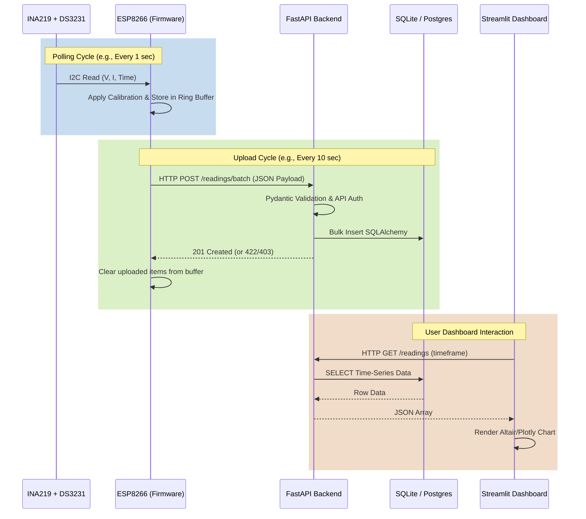

# Data Flow Diagram

Understanding the exact data lifecycle in VoltWatch.

```mermaid
sequenceDiagram
    participant Hardware as INA219 + DS3231
    participant ESP as ESP8266 (Firmware)
    participant API as FastAPI Backend
    participant DB as SQLite / Postgres
    participant UI as Streamlit Dashboard

    rect rgb(200, 220, 240)
        Note over Hardware,ESP: Polling Cycle (e.g., Every 1 sec)
        Hardware->>ESP: I2C Read (V, I, Time)
        ESP->>ESP: Apply Calibration & Store in Ring Buffer
    end

    rect rgb(220, 240, 200)
        Note over ESP,DB: Upload Cycle (e.g., Every 10 sec)
        ESP->>API: HTTP POST /readings/batch (JSON Payload)
        API->>API: Pydantic Validation & API Auth
        API->>DB: Bulk Insert SQLAlchemy
        API-->>ESP: 201 Created (or 422/403)
        ESP->>ESP: Clear uploaded items from buffer
    end

    rect rgb(240, 220, 200)
        Note over UI,DB: User Dashboard Interaction
        UI->>API: HTTP GET /readings (timeframe)
        API->>DB: SELECT Time-Series Data
        DB-->>API: Row Data
        API-->>UI: JSON Array
        UI->>UI: Render Altair/Plotly Chart
    end
```
